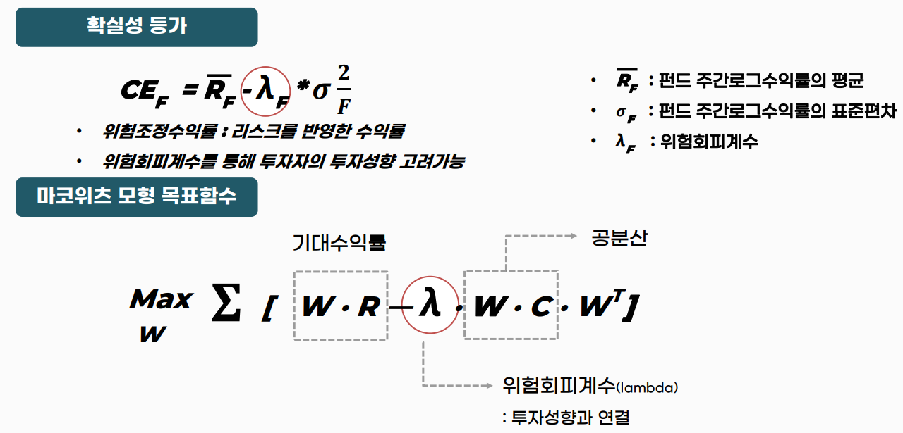
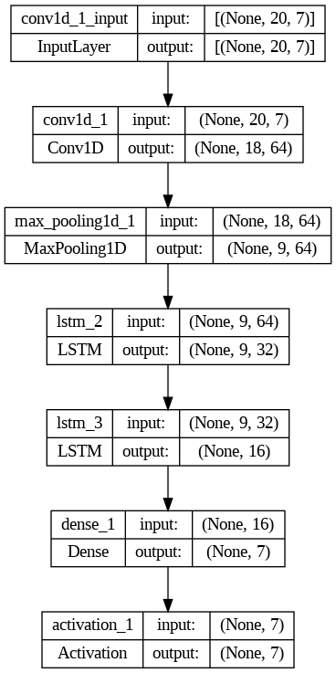

# Dynamic Asset Allocation with LSTM
This project aims to predict dynamic asset allocation using a Long Short-Term Memory (LSTM) model. Asset allocation refers to the composition of an investment portfolio, and in this project we are looking at assets such as stocks, bonds, and cash.

## Project Structure
This project consists of the following

* data: A folder where asset price data for stocks, bonds, cash, etc. is stored.
* models: A folder where code related to the LSTM model is stored.
* src: A folder where utility functions, such as data preprocessing, are stored.
* notebooks: The folder where Jupyter Notebook files are stored.
* main.py: The file that serves as the entry point for the program.

## Data
* Kospi : Log return data for the Korean stock market index
* short_bond : Log Return with Interest for short term Corporate bond AA rating
* mid_bond : Log Return with Interest for mid term Corporate bond AA rating
* long_bond : Log Return with Interest for long term Corporate bond AA rating
* iau(gold ETF) : Log return data for the gold ETF
* dbc(raw materials ETF) : Log return data for raw materials ETF
* vnq(real estate ETF) :Log return data for real estate ETF

## loss function
The loss function uses a mixture of certainty equivalents and a Markowitz model objective function. You can adjust the risk aversion coefficient (lambda value) in the certainty equivalence to adjust the risk tolerance of the model.

## Model Architecture
Set the Markowitz portfolio optimization function as the loss function of the deep learning model(CNN + LSTM) to perform dynamic asset allocation.
In time series data forecasting problems, CNN and LSTM can be used together to extract localized features with CNN and create a forecasting model that better reflects historical information with LSTM. This can lead to more accurate closing price predictions. The combined use of CNNs and LSTMs can also be useful in other problems.

## Evaluation

## How to Run
1. save the time series log return data in the data folder.
2. set the config file in the src folder
3. run main.py (visualize training and backtesting returns)

 
